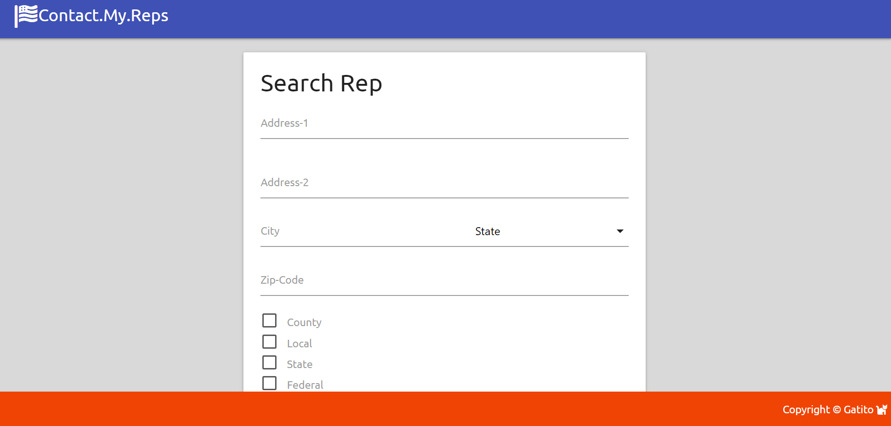

# PROJECT1 : CONTACT MY REPS APP 
## Project Description
The Contact My Reps is designed for the civic-minded user, who wants to contact their government representatives.  Depending on the user's intentions, using their address they will be able to find out who is representing them in local, state and federal government depending on their choices.  

Although all of the options of representation will be available to the user thru the ap, only the boxes that are checked at the bottom will be revealed.  Once the names of the chosen representatives appear, their contact info can be obtained.

## User Story
AS A US resident engaged with politics.
I WANT to get to know who are my government representatives.

SO THAT I can get in touch with them and let them know about or follow up on issues that affect me and my community.

THEN I'm given the opportunity to save chosen representatives to a directory for later reference.

## Technologies
Materialize CSS Framework

Googele Fonts and Fontawesome.

JavaScript and JQuery.

API Smarty Streets(https://smartystreets.com) to verify street addresses.

API Civic Info (https://developers.google.com/civic-information) to get the representative results.  

## Future Enhancements
Input validation fully implemented.

Get rid of media queries.

Dynamic row styling.

Local live server configuration.

Civic information 404 photo link return handler.

Find SmartyStreets permanent and free alternative.

## Deployment
Live link: https://carlosissac.github.io/project1contactmyreps/
GitHub repo: https://github.com/carlosissac/project1contactmyreps

